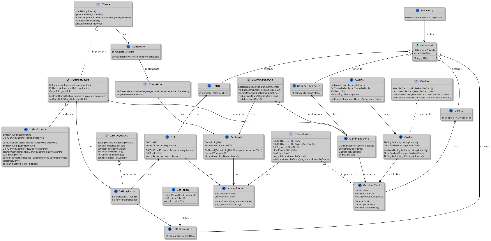

# casino-jack

## Jenkins CI
Clone repository into /home/Documents/

Steps to set up CI configuration:
1. Make a copy of .env.example and change it name to .env
2. Change HOME value to your own home variable
3. Run docker network create jenkins
4. Run docker-compose up -d (detached: run in the background)
5. Open your browser at localhost:8081

Go to https://www.jenkins.io/doc/tutorials/build-a-java-app-with-maven/#setup-wizard for the next steps.

## Distribution of work

Creating tests and implementation for the behaviour of specific classes at least needs to be distributed according to the next rules:

* Qi-Mo: cashier, bettinground, abstractgame, BetID

* Mikel: defaultgame, gamblercard, BettingRoundID, GamingMachineID

* Stoyan: gamingmachine, gamerule, idfactory, CardID 

## Diagrams
### C4 model
#### Level 1

#### Level 2

#### Level 3

### Class diagram

